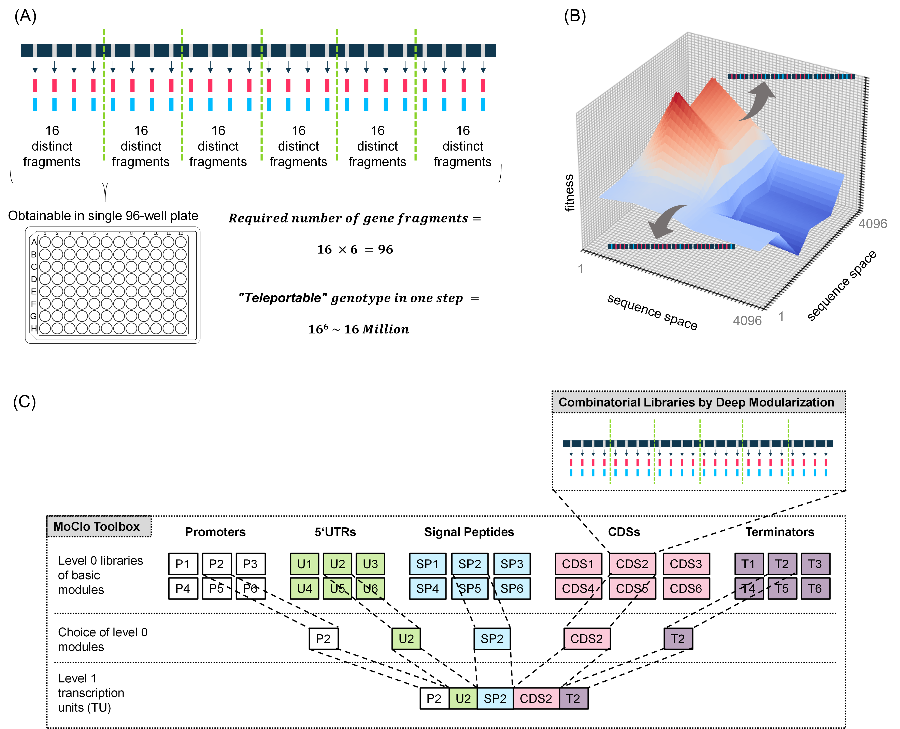
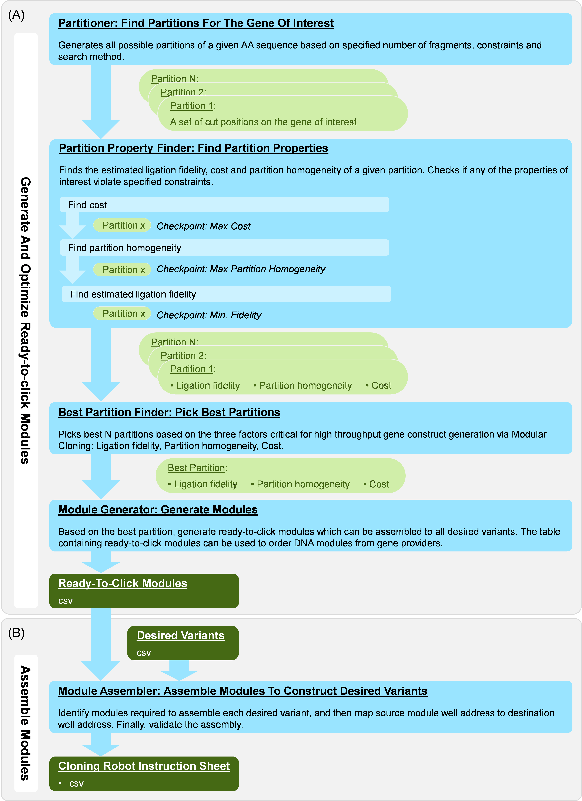

 
## SeqTeleporter: A Rapid Sequence Space Explorer For Combinatorial Protein Library

[](https://github.com/Bayer-Group/SeqTeleporter/actions/workflows/build.yml)
[](https://github.com/Bayer-Group/SeqTeleporter/actions/workflows/static_typing.yml)
[](https://github.com/Bayer-Group/SeqTeleporter/actions/workflows/generate_demo.yml)

### Setup environment
Compatible python version: 3.9, 3.10, 3.11

1. ```pip install --upgrade pip```
2. ```pip install -r requirements-dev.txt```

### Demo
You can view the demo notebook [here](https://upgraded-guacamole-wg672kk.pages.github.io/)
### Abstract
In the highly dynamic field of pharmaceutical R&D, the development of therapeutic biologics demands innovative solutions that enhance efficiency and reduce costs while maintaining robustness and reliability. We present SeqTeleporter, a state-of-the-art tool designed to address these needs by optimizing the process of multi-site mutagenesis, a crucial step in protein engineering.
SeqTeleporter empowers the creation of any desired mutant combinations from multiple positions of interest, with numerous variations for each position. It intelligently divides sequences with mutations, allowing for their reuse across multiple design-build-test-learn cycles, thereby significantly accelerating the construction of protein engineering libraries.
To illustrate the power of SeqTeleporter, consider the scenario of targeting any preferred combinations of mutants from 24 positions of interest, with 2 variations for each position. This allows for the creation of over 10^7 distinct combinations in the sequence space. The tool is designed to facilitate the one-step construction of any desired combination found within over 10^7 "teleportable" coordinates in the sequence space. This capability enables SeqTeleporter to move beyond the limitations of traditional protein library design. It provides a unique capability to instantly navigate, explore, and sample extensive sequence spaces in a single step, all while optimizing costs and ensuring a reliable process.
SeqTeleporter is more than just a multi-site mutagenesis tool. Its potential for seamless integration with machine learning processes further elevates its significance, positioning it as a key player in next-generation protein engineering strategies.
In summary, SeqTeleporter emerges as a valuable asset in the field of therapeutic biologics engineering. By enhancing the efficiency of the protein engineering process, it brings us one step closer to our goal: improving patient lives through the development of effective and affordable biological therapies.


**Figure 1.  SeqTeleporter concept enabling instantaneous sampling of vast sequence space and integration to MoClo framework.**\
(A)  By distributing the mutations on interest evenly on each module of the gene of interest, we unlock the ability to probe a vast variant space by recombining modules containing part of the desired genotype. For instance, a gene with 24 mutations sites and 2 variations for each site results in around 16 million distinct genotypes. By distributing the mutation sites to six partitions of the gene, we only required 16 distinct fragments for each partition - in total 96 fragments – to cover the desired variant space of 16 million. (B) The variant space of the desired mutations can be conceptualized as the 3-dimentional space, with x and y axis being all 163 (=4096) possible genotype combinations of 3 of the six partitions, and the z-axis being the fitness of each of the variant. By combining one fragment of desired genotype from each partition, we can obtain any genotype of interest within the 16 million distinct genotypes. In another words, we conceptually “teleport” to any coordinate of interest in the variant space. (C) SeqTeleporter optimize the combinatorial library generation considering the integration of users existing MoClo framework for optimal protein expression and purification.

### Process Overview

**Figure 2  SeqTeleporter Components and Workflow Overview.**
